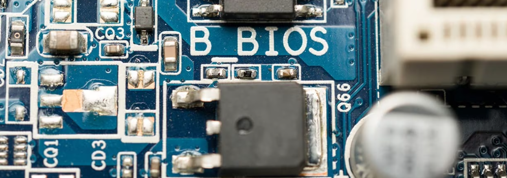
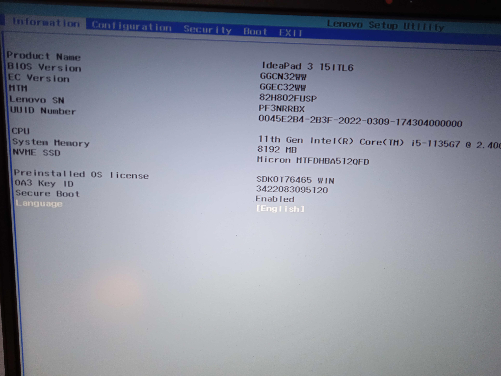
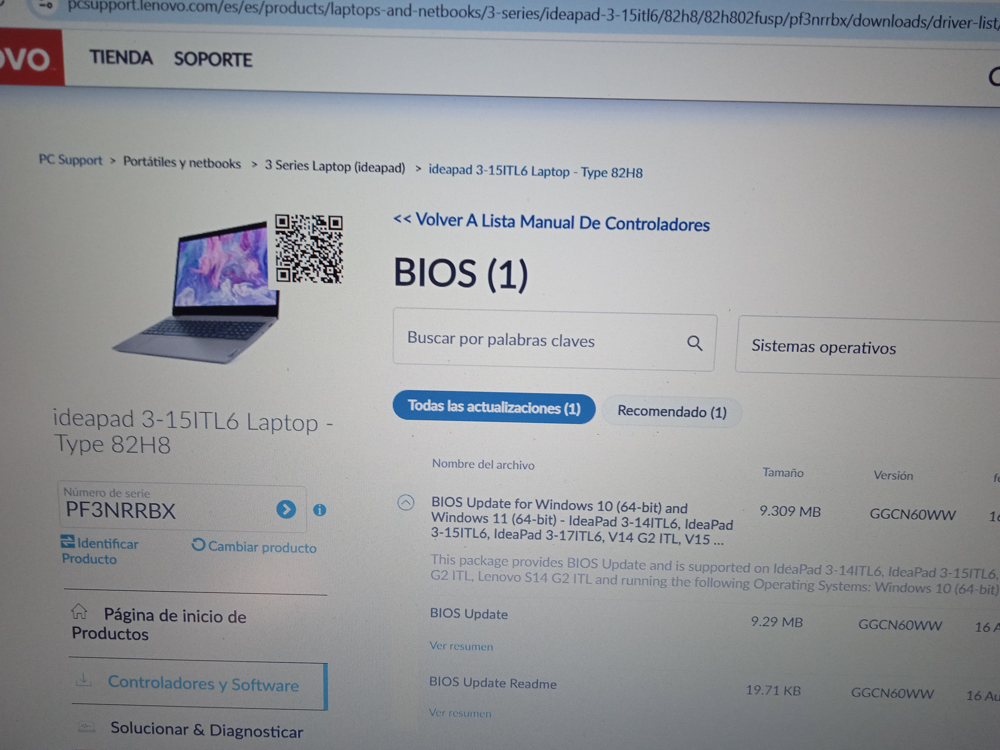
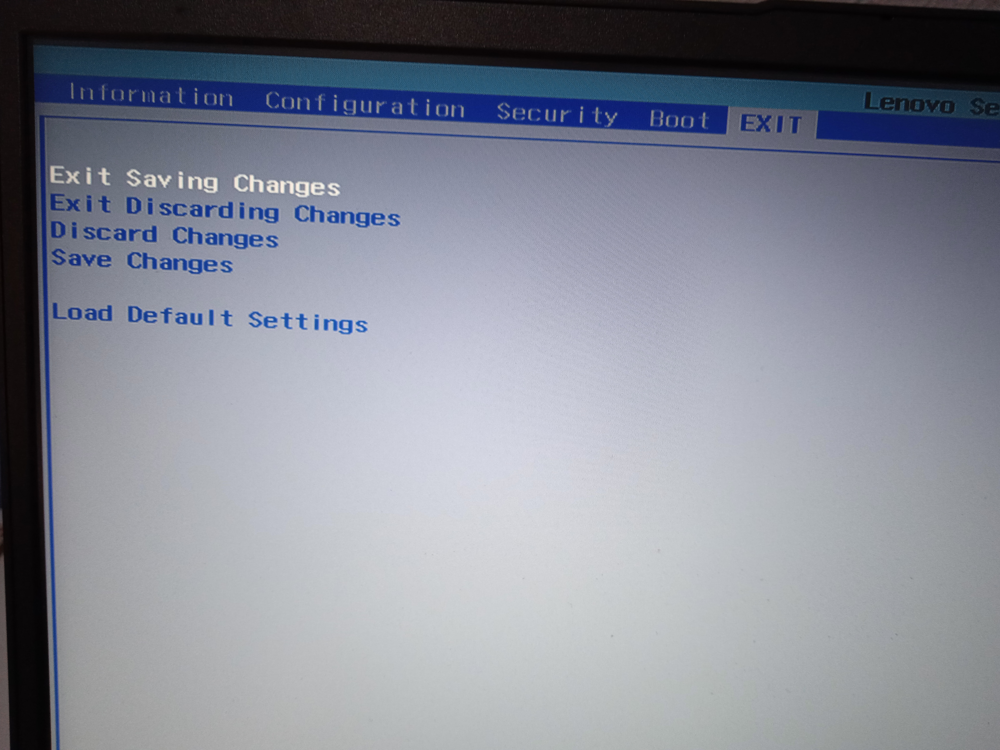

author: Santiago Domínguez Gómez
summary: Guía para bastionado de la BIOS Lenovo GGCN32WW
id: bastionadobioslenovo
categories: bastionado,BIOS
environments: Web
status: Published
feedback link:


# Bastionado BIOS Lenovo

## Introducción
A continuación se muestra una guía paso a paso para bastionar la BIOS **Lenovo GGCN32WW**.



En ella se detallarán los parámetros que deberemos configurar para aportar seguridad al sistema y dificultar la manipulación del arranque.

## Acceso a la BIOS
Para acceder a la BIOS tendremos que reiniciar el equipo en primer lugar y, durante el arranque, 
presionar repetidamente la tecla **F2**, ó **Fn+F2** si el modo de teclas de acceso rápido **(HotKey Mode)** está habilitado.



## Configuración de contraseñas

### Contraseña de administrador
En primer lugar estableceremos una contraseña de administrador.

Para ello accederemos a 
```
Security → Set Administrator Password
```


Una vez allí ingresaremos y confirmaremos una contraseña segura.


### Contraseña de encendido
Ahora habilitaremos la contraseña de encendido.

Para ello accederemos a
```
Security → Power On Password
```
 y seleccionaremos **`Enable`**.


### Contraseña de usuario
De manera opcional podremos establecer una contraseña de usuario.

Para ello accederemos a
```
Security → Set User Password
```
 e ingresaremos y confirmaremos una contraseña.


## Configuración de arranque

### Modo de arranque
Deberemos acceder a la sección **`Boot`** y establecer el Boot Mode como **`UEFI Only`**, puesto que este será el modo de arranque más seguro para nuestro sistema.

Ahora bien, en el caso de esta BIOS, si accedemos a dicha sección veremos que aparece la palabra **`EFI`**.


EFI es la partición del sistema donde se almacena la información de arranque, y es utilizada por los equipos que poseen la **Interfaz de Firmware Extensible Unificada (UEFI)**.

Es decir, el boot mode ya está establecido en UEFI por defecto, luego no será necesario realizar ninguna acción.

### Orden de arranque
Si accedemos nuevamente a la sección **`Boot`** y previamente hemos insertado una unidad USB de arranque, veremos que por defecto el primer dispositivo de arranque es la unidad de disco duro.


Para cambiar el orden de arranque podemos hacer uso de las teclas F5 y F6.


### Arranque desde dispositivos externos
Una buena práctica de seguridad consiste en deshabilitar el arranque desde dispositivos externos.

Para ello, deberemos buscar la opción **`USB Boot`** en la sección **`Boot`** y seleccionar **`Disabled`**.


### Secure Boot
Para habilitar el Secure Boot iremos a la sección **`Security`**. Una vez allí nos aseguraremos de que la opción **`Secure Boot`** esté marcada como **`Enabled`**.


Es fundamental habilitar esta opción ya que impide la ejecución durante el arranque de aplicaciones no firmadas o certificadas, lo que previene los ataques de código malicioso.

## Configuración adicional
Como opciones de configuración adicionales se recomiendan las siguientes:

### Deshabilitar puertos y características innecesarias
Es conveniente deshabilitar puertos y características que no se utilicen para evitar posibles brechas de seguridad en nuestro sistema.

Para ello deberemos revisar todas las opciones disponibles en la sección **`Configuration`** y desactivar aquellas que no cumplan ninguna función primordial.


### Actualizar BIOS
Deberemos mantener la BIOS actualizada siempre a la última versión disponible con el fin de corregir vulnerabilidades conocidas.

Para ello deberemos acceder con cierta periodicidad a la página de soporte de Lenovo en busca de nuevas actualizaciones para nuestra BIOS.




[Enlace al sitio web](https://pcsupport.lenovo.com/es/es/products/laptops-and-netbooks/3-series/ideapad-3-15itl6/82h8/82h802fusp/pf3nrrbx/downloads/driver-list/component?name=BIOS&id=5AC6A815-321D-440E-8833-B07A93E0428C "Enlace sitio web")

### Contraseñas de disco duro
Como última medida adicional podemos establecer contraseñas de disco duro con el fin de proteger el acceso al mismo durante el arranque.

Entonces, accederemos una última vez a la sección **`Security`** y seleccionaremos la opción **`Set Hard Disk Passwords`**.


Tendremos que introducir dos contraseñas:
+ **Master password**: Es la contraseña principal del disco duro. Ofrece acceso completo al disco duro y sus configuraciones de seguridad.


+ **User password**: Es una contraseña secundaria que ofrece acceso limitado al disco duro para uso diario.


## Finalizar y guardar cambios
Una vez realizadas todas las configuraciones deberemos ir a la sección **`Exit`** y seleccionar **`Exit Saving Changes`**.

Deberemos confirmar para guardar los cambios y reiniciar el sistema.




